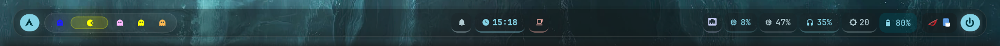
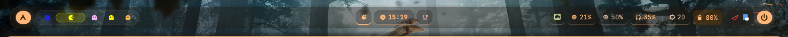
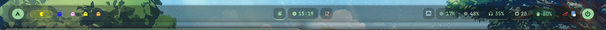
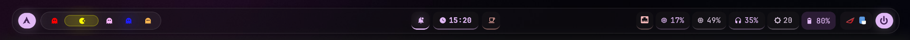
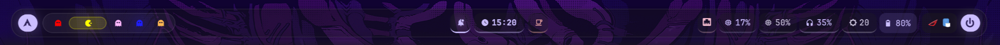
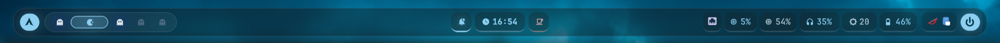

# 🔮 GhostGlaze Waybar

A minimal, dreamy glassmorphism Waybar theme featuring **Matugen** dynamic colors and a custom **Pacman-Logic** workspace system.

## ✨ Features
- **Ghost Workspaces:** Inactive workspaces appear as colorful ghosts (Blinky, Inky, Pinky, Clyde).
- **Compromised Blue:** Occupied workspaces turn dark blue.
- **Pacman Active:** The current workspace always glows bright yellow.
- **Triple Pearl Center:** Symmetrical pods for Notifications, Clock, and Inhibit-Suspend.

## 📸 The Palette (Dynamic Gallery)
GhostGlaze adapts to your wallpaper instantly using Matugen. Here is how it looks across different environments:

### 1. Dynamic Colours based on Matugen.

  

| [Variant 2] | [Variant 3] |
| :---: | :---: |
|  |  |

| [Variant 4] | [Variant 5] |
| :---: | :---: |
|  |  |

### Version 2 Preview

### Prerequisites
- **Fonts:** [JetBrainsMono Nerd Font](https://www.nerdfonts.com/font-downloads) (Required for icons).
- **Colors:** [Matugen](https://github.com/InioS/matugen) (Required for dynamic colors).
- **Compositor:** Hyprland (Required for the glass blur effect).

## 🛠 Installation
1. Clone this repository:
     `git clone https://github.com/TheRealNeoShade/GhostGlaze-Waybar.git`
   Copy the files to your config:
     `cp -r GhostGlaze-Waybar/* ~/.config/waybar/`
2. Move `config.jsonc` and `style.css` to `~/.config/waybar/`.
3. Ensure you have **Matugen** installed for dynamic colors.

